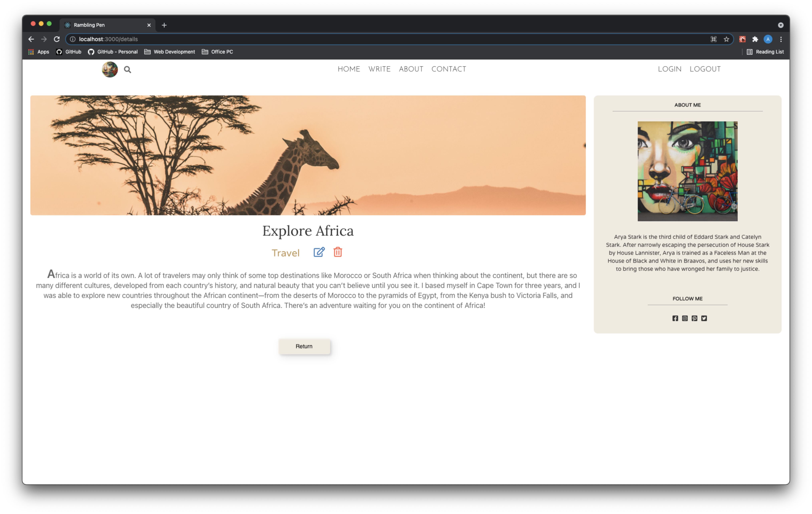
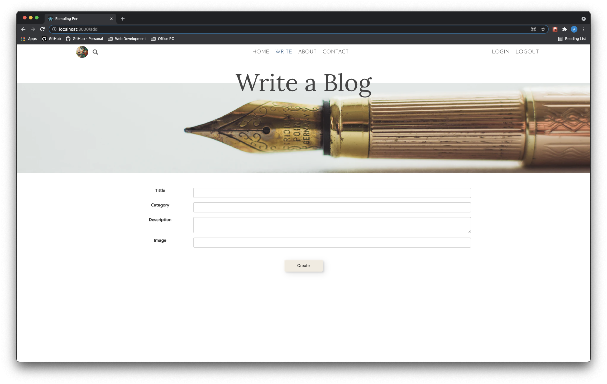
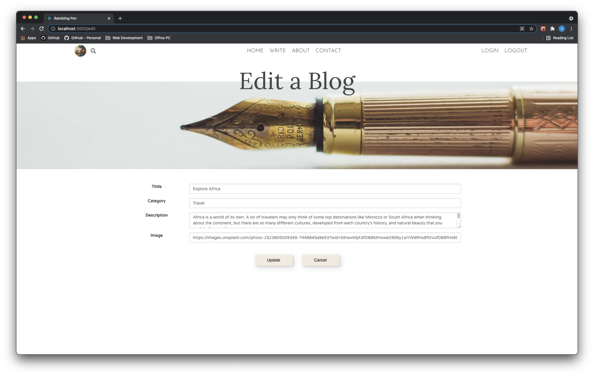
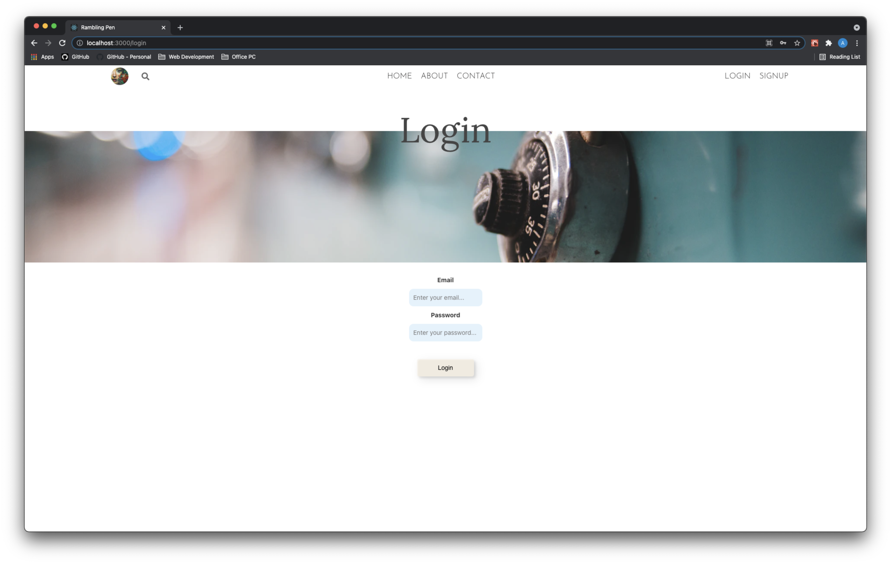

# Rambling Pen

#### Rembling Pen is blogsite, A Full-Stack MERN App.

---

- Site : [Rambling Pen](https://rambling-pen.herokuapp.com/)
- Technologies used :

  - React.js
  - Express.js
  - RESTful routing
  - MongoDB
  - Mongoose
  - Node.js
  - JavaScript
  - CSS
  - AJAX
  - Dotenv

- Project Managment :

  - [Trello Board](https://trello.com/b/6nieEOLP/react-blogsite)
  - [ERD](https://lucid.app/lucidchart/847c5854-99e3-4d5a-b57e-174969485979/edit?page=0_0&invitationId=inv_33a423b0-d358-48e8-aa2a-828d2bbb5c24#)

- Screenshots :
  - Home Page
  - Show Page
  - Add Page
  - Update Page
  - Login Page
  - Signup Page

---

## Future Goals

- Implementing search and short features
- Polishing UI
- Cleaning up the Code
